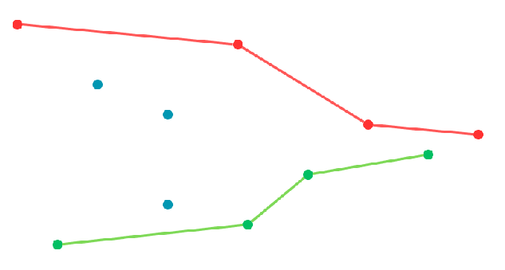

| problem                                                                                                | code                                                                                                       | solutio                                                        | my notes                                                                                                                                                                   |
|--------------------------------------------------------------------------------------------------------|------------------------------------------------------------------------------------------------------------|----------------------------------------------------------------|----------------------------------------------------------------------------------------------------------------------------------------------------------------------------|
| 🟢 [Valid Parentheses](https://leetcode.com/problems/valid-parentheses/)                               | [js](https://github.com/shayansm2/leetcodeSolutions/blob/main/src/easy/ValidParentheses.js)                | stack                                                          | could have added termination logics                                                                                                                                        |
| 🟡 [Min Stack](https://leetcode.com/problems/min-stack/)                                               | [go](https://github.com/shayansm2/leetcodeSolutions/blob/main/src/medium/MinStack.go)                      | stack                                                          | min/max of a stack can stays in the last node `implementation`                                                                                                             |
| 🟡 [Evaluate Reverse Polish Notation](https://leetcode.com/problems/evaluate-reverse-polish-notation/) | [go](https://github.com/shayansm2/leetcodeSolutions/blob/main/src/medium/EvaluateReversePolishNotation.go) | stack                                                          | advantage of reverse Polish notation is that it removes the need for order of operations and parentheses that are required by infix notation and can be evaluated linearly |
| 🟡 [Generate Parentheses](https://leetcode.com/problems/generate-parentheses/)                         | [go](https://github.com/shayansm2/leetcodeSolutions/blob/main/src/medium/GenerateParentheses.go)           | backtracking, recursion                                        | ⭐⭐                                                                                                                                                                         |
| 🟢 [Next Greater Element I](https://leetcode.com/problems/next-greater-element-i/)                     | [go](https://github.com/shayansm2/leetcodeSolutions/blob/main/src/medium/NextGreaterElementI.go)           | monotonic stack (*find the next greater element*)              |                                                                                                                                                                            |
| 🟡 [Next Greater Element II](https://leetcode.com/problems/next-greater-element-ii/)                   | [go](https://github.com/shayansm2/leetcodeSolutions/blob/main/src/medium/NextGreaterElementII.go)          | monotonic stack (*find the next greater element*)              |                                                                                                                                                                            |
| 🟡 [Daily Temperatures](https://leetcode.com/problems/daily-temperatures/)                             | [go](https://github.com/shayansm2/leetcodeSolutions/blob/main/src/medium/DailyTemperatures.go)             | monotonic stack (*find the next day with greater temperature*) | ⭐                                                                                                                                                                          |
| 🟡 [Car Fleet](https://leetcode.com/problems/car-fleet/)                                               | [go](https://github.com/shayansm2/leetcodeSolutions/blob/main/src/medium/CarFleet.go)                      | array(`o(n2)`), monotonic stack(`o(n)`)                        | ⭐ mathematical thinking behind this question was the important part, not the data structures and algorithms, creative solution                                             |
| 🟡 [Remove K Digits](https://leetcode.com/problems/remove-k-digits/)                                   |                                                                                                            |
| 🔴 [Largest Rectangle In Histogram](https://leetcode.com/problems/largest-rectangle-in-histogram/)     |                                                                                                            |

---

### notes:

#### Monotonic Stack

A monotonic stack is a stack whose elements are monotonically increasing or decreasing.
Sometimes we store the index of the elements in the stack and make sure the elements corresponding to those indexes in
the stack forms a mono-sequence. **the usage of this stack is to when we want to know to next max/min element of each
element in an array.** it also can be used to get the minimum upward line ot maximum downward line in a trend.



there are two ways you can implement the monotonic queue

```go
package main

func ForwardTraverse(nums []int) {
	var stack []int // ascending
	for _, val := range nums {
		for len(stack) > 0 && stack[len(stack)-1] < val {
			stack = stack[:len(stack)-1]
		}
		stack = append(stack, val)
	}
}

```

```go
package main

func BackwardTraverse(nums []int) {
	var stack []int // descending
	for i := len(nums) - 1; i >= 0; i-- {
		val := nums[i]

		if len(stack) > 0 && stack[len(stack)-1] < val {
			stack = append(stack, val)
		}
	}
}
```

source for other [problems of monotonic stack](https://liuzhenglaichn.gitbook.io/algorithm/monotonic-stack)

#### Car Fleet Solution

[//]: # (todo)

[//]: # (target comparison vs two cars comparison)

[//]: # (or instead of comparing each two elements of an array in the last problem, have a source point)

```go
package main

import "sort"

type Car struct {
	initPosition int
	speed        int
}

func carFleet(target int, position []int, speed []int) int {
	cars := make([]Car, len(position))
	for i := range position {
		cars[i] = Car{initPosition: position[i], speed: speed[i]}
	}

	sort.Slice(cars, func(i, j int) bool {
		return cars[i].initPosition < cars[j].initPosition
	})

	arrivalTimeStack := []float32{}

	// BackwardTraverse
	for i := len(cars) - 1; i >= 0; i-- {
		arrivalTime := float32(target-cars[i].initPosition) / float32(cars[i].speed)
		if len(arrivalTimeStack) == 0 || arrivalTimeStack[len(arrivalTimeStack)-1] < arrivalTime {
			arrivalTimeStack = append(arrivalTimeStack, arrivalTime)
		}
	}

	// ForwardTraverse
	for _, car := range cars {
		arrivalTime := float32(target-car.initPosition) / float32(car.speed)
		for len(arrivalTimeStack) > 0 && arrivalTimeStack[len(arrivalTimeStack)-1] <= arrivalTime {
			arrivalTimeStack = arrivalTimeStack[:len(arrivalTimeStack)-1]
		}
		arrivalTimeStack = append(arrivalTimeStack, arrivalTime)
	}

	return len(arrivalTimeStack)
}

```